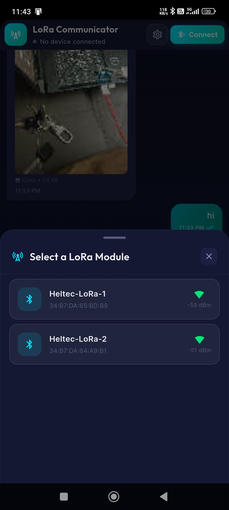
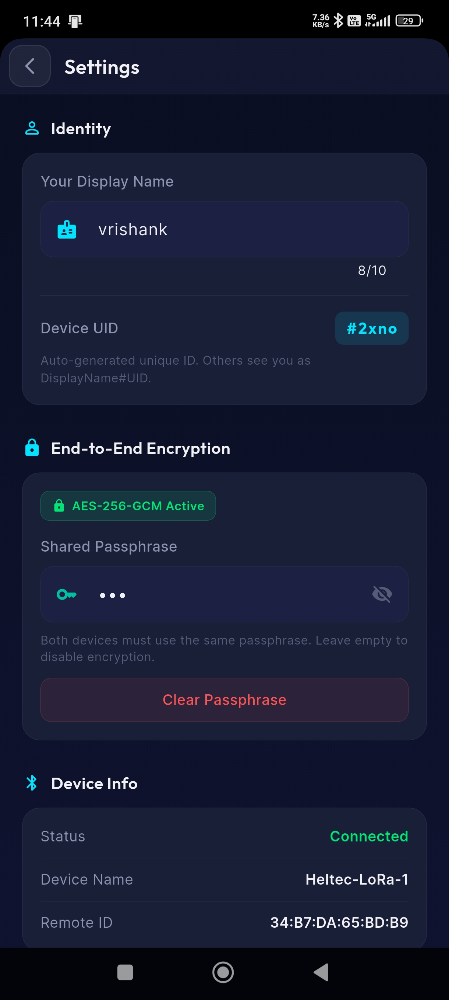

# LoRa Messaging App

A cross-platform Flutter application for sending and receiving messages and media over LoRa (Long Range) radio, ensuring communication even without internet or cellular connectivity.

## Documentation
- [**Features Overview**](docs/FEATURES.md): Detailed breakdown of the app's capabilities including Offline Messaging, Media Support (Text, Audio, Images, GIFs), and End-to-End Encryption.
- [**System Logic**](docs/LOGIC.md): Technical explanation of the underlying logic, including Data Chunking, BLE Integration, and UI Lockout mechanisms.

## Screenshots

### Device Discovery & Connection

### Secure Encryption Setup

### Sending Data Chunks

### Receiving Data Chunks

## Getting Started

This project is a starting point for a Flutter application.
A few resources to get you started if this is your first Flutter project:

- [Lab: Write your first Flutter app](https://docs.flutter.dev/get-started/codelab)
- [Cookbook: Useful Flutter samples](https://docs.flutter.dev/cookbook)

For help getting started with Flutter development, view the
[online documentation](https://docs.flutter.dev/), which offers tutorials,
samples, guidance on mobile development, and a full API reference.
