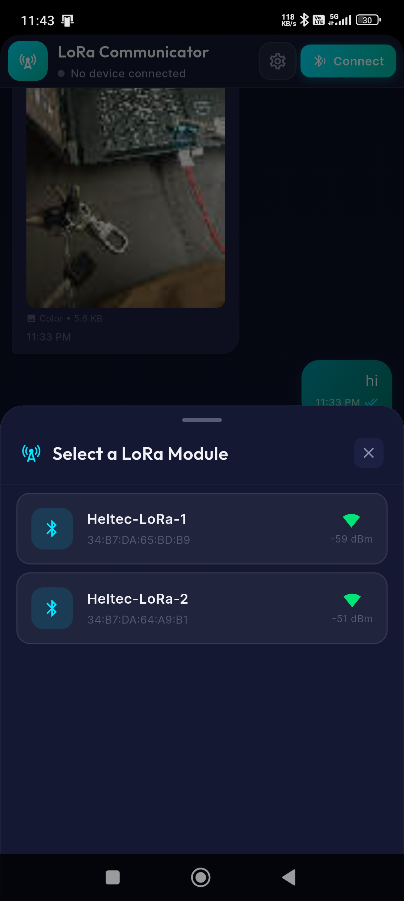
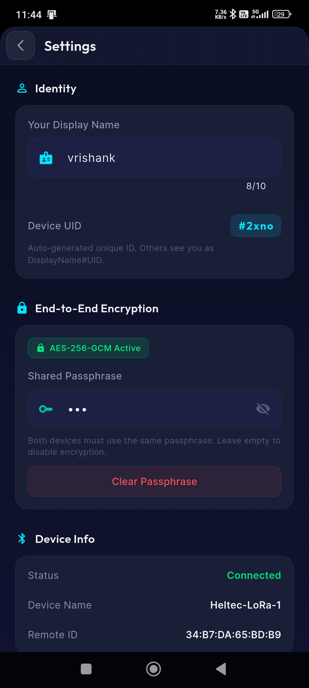

# 📡 LoRa Messaging App

> A cross-platform Flutter application for sending and receiving messages and media over LoRa (Long Range) radio — no internet, no cellular, no problem.

<br/>

## 🌐 Overview

LoRa Communicator enables secure, off-grid peer-to-peer communication by pairing a mobile device with a LoRa radio module via Bluetooth Low Energy (BLE). Designed for remote environments, emergency scenarios, or anywhere connectivity is unavailable.

<br/>

## ✨ Features

| Feature | Description |
|---|---|
| 💬 **Text Messaging** | Send and receive plain-text messages over LoRa |
| 🖼️ **Image Transfer** | Chunked image transmission with progress tracking |
| 🎙️ **Voice Notes** | Record and send audio clips |
| 🔐 **End-to-End Encryption** | AES-256-GCM encryption for all transmissions |
| 📶 **BLE Integration** | Connects to LoRa hardware via Bluetooth Low Energy |
| 📦 **Data Chunking** | Automatic fragmentation and reassembly of large payloads |
| 🔒 **UI Lockout** | Screen locks during active transmission to prevent interference |

<br/>

## 📸 Screenshots

<table>
  <tr>
    <td align="center">
      
      <br/>
      <sub><b>Device Discovery & Connection</b></sub>
    </td>
    <td align="center">
      
      <br/>
      <sub><b>Secure Encryption Setup</b></sub>
    </td>
  </tr>
  <tr>
    <td align="center">
      
      <br/>
      <sub><b>Sending Data Chunks</b></sub>
    </td>
    <td align="center">
      
      <br/>
      <sub><b>Receiving Data Chunks</b></sub>
    </td>
  </tr>
</table>

<br/>

## 🏗️ Architecture

```
lib/
├── constants/          # App-wide constants and theme
├── models/             # Data models (ChatMessage, TransmissionProgress)
├── providers/          # State management (Provider)
├── screens/            # UI screens (Chat, Settings, Loading, Blocked)
├── services/           # Core logic (BLE, Encryption, Audio, Image, Packet Framing)
└── widgets/            # Reusable UI components
```

<br/>

## 🔧 Tech Stack

| Layer | Technology |
|---|---|
| Framework | Flutter 3 / Dart |
| BLE Communication | `flutter_blue_plus` |
| Encryption | `cryptography` (AES-256-GCM) |
| State Management | `provider` |
| Audio | `record` + `audioplayers` |
| Image Processing | `image_picker` + `image` |
| Storage | `shared_preferences` |
| Fonts | `google_fonts` |

<br/>

## 📖 Documentation

- [**Features Overview**](docs/FEATURES.md) — Detailed breakdown of all app capabilities
- [**System Logic**](docs/LOGIC.md) — Technical explanation of chunking, BLE flow, and encryption

<br/>

## 🚀 Getting Started

### Prerequisites

- [Flutter SDK](https://docs.flutter.dev/get-started/install) `>=3.0.0`
- An Android or iOS device with Bluetooth support
- A compatible LoRa radio module (e.g., Heltec, TTGO, or similar BLE-capable LoRa hardware)

### Installation

```bash
# Clone the repository
git clone https://github.com/priyanshuu-02/LoRa_Messaging_App.git
cd LoRa_Messaging_App

# Install dependencies
flutter pub get

# Run on a connected device
flutter run
```

### Android Permissions

The app requires the following permissions on Android:

- `BLUETOOTH` / `BLUETOOTH_SCAN` / `BLUETOOTH_CONNECT`
- `ACCESS_FINE_LOCATION` (required for BLE scanning on Android)
- `RECORD_AUDIO` (for voice notes)
- `READ_EXTERNAL_STORAGE` / `WRITE_EXTERNAL_STORAGE` (for image sharing)

<br/>

## 📄 License

This project is currently unlicensed. Add a `LICENSE` file to specify terms.

<br/>

<p align="center">Built with Flutter &nbsp;•&nbsp; Off-grid by design</p>
